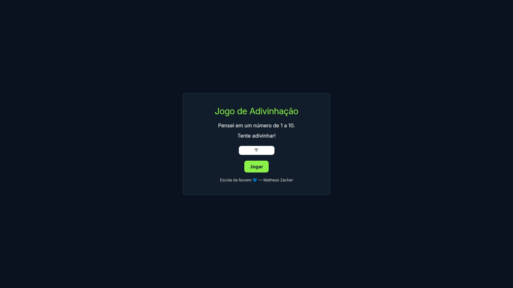

# Jogo de Adivinhação na Nuvem ☁️🎮

Este projeto é um **lab prático** desenvolvido para exercitar conceitos de **arquitetura em nuvem** utilizando:

- **AWS Lambda**
- **API Gateway**
- **Amazon S3 (Frontend)**
- **Terraform** para provisionamento da infraestrutura

---

## 🎯 Objetivo do Lab

O projeto implementa um simples **jogo de adivinhação**:

- A aplicação pensa em um número de **1 a 10**.
- O usuário insere um palpite em um campo de input e clica em **Jogar**.
- O backend (Lambda) retorna se o palpite está correto ou não.
- O frontend exibe o resultado na tela.

Exemplo de retorno:
```
Quase! O número era 6. Tente novamente! 🤓
```

---

## 🚀 Arquitetura

A arquitetura provisionada com **Terraform** é composta por:

1. **Frontend (S3 + Website Hosting)**  
   - Bucket S3 configurado para hospedagem estática.  
   - Arquivo `index.html` dinâmico, onde o endpoint da API é injetado via `templatefile`.  

2. **Backend (Lambda + API Gateway)**  
   - Função Lambda responsável pela lógica do jogo.  
   - API Gateway expõe a Lambda através de uma rota **GET /jogo**.  

3. **Infraestrutura como Código**  
   - Todo o ambiente é criado utilizando **Terraform**, garantindo reprodutibilidade e versionamento da infraestrutura.  

## 🎮 Jogo de Adivinhação na Nuvem


---

## 📂 Estrutura do Projeto

```
.
├── frontend/
│   └── index.html.tmpl      # Template do frontend com variável para API 
├── lambda_code/
│   └──lambda_function.zip   # Código da função Lambda               
├── api-gateway.tf           # Configuração do API Gateway
├── lambda.tf                # Configuração da função Lambda
├── locals.tf                # variável utilizada dentro do template
├── main.tf                  # Definição principal do Terraform
├── s3-bucket.tf             # Configuração do bucket S3       
├── s3-object.tf             # Configuração do objetos no bucket
└── README.md                # Este arquivo

```

---

## 🚀 Como Executar

1. **Clonar o repositório**
```bash
git clone https://github.com/Zacher99/lab-game.git
cd lab-game
```

2. **Inicializar o Terraform**
```bash
terraform init
```

3. **Validar o plano**
```bash
terraform plan
```

4. **Aplicar as mudanças**
```bash
terraform apply
```

5. **Acessar o frontend**  
   - Após o deploy, o Terraform exibirá a URL do **S3 Static Website Hosting**.  
   - Abra a URL no navegador e jogue! 🎉  

---

## 💡 Tecnologias Utilizadas

- **AWS Lambda**
- **Amazon API Gateway**
- **Amazon S3**
- **Terraform**

---

## ✨ Autor

Feito com 💙 no programa **Escola da Nuvem**  
**Matheus Zacher**
